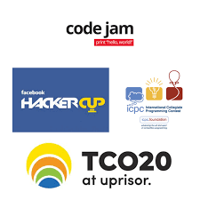

###  Solo Speed Contest
> **I have participated in several online solo speed contest. Below I have mentioned some of them.** 

|_____|Contest [Github]|Solved|
|-----|----------------|------|
|| [**Solo Speed Contest 115**](https://github.com/khalid586/Solo-speed-contests/tree/main/solo%20speed%20contest%20115)|**02**|
|| [**Solo Speed Contest 105**](https://github.com/khalid586/Solo-speed-contests/tree/main/solo%20speed%20contest%20105)|**02**|
|| [**Solo Speed Contest 90**](https://github.com/khalid586/Solo-speed-contests/tree/main/solo%20speed%20contest%2090)|**04**|
|| [**Solo Speed Contest 83**](https://github.com/khalid586/Solo-speed-contests/tree/main/solo%20speed%20contest%2083)|**03**|
|| [**Solo Speed Contest 79**](https://github.com/khalid586/Solo-speed-contests/tree/main/solo%20speed%20contest%2079)|**03**|
|| [**Solo Speed Contest 78**](https://github.com/khalid586/Solo-speed-contests/tree/main/solo%20speed%20contest%2078)|**03**|
|| [**Solo Speed Contest 77**](https://github.com/khalid586/Solo-speed-contests/tree/main/solo%20speed%20contest%2077)|**04**|
|| [**Solo Speed Contest 8**](https://github.com/khalid586/Solo-speed-contests/tree/main/solo%20speed%20contest%208)|**02**|
|| [**Solo Speed Contest 5**](https://github.com/khalid586/Solo-speed-contests/tree/main/solo%20speed%20contest%205)|**03**|
|| [**Solo Speed Contest 4**](https://github.com/khalid586/Solo-speed-contests/tree/main/solo%20speed%20contest%204)|**04**|

### Want to improve problem solving speed?
>  **Solo speed contest   Solo speed contests are arranged by Bangladesh CP Server , a discord server of competitive programmers of Bangladesh.They organize these 1 hour long speed contests to improve problem solving speed of programmers.   You will get the contests [here](https://vjudge.net/contest#category=all&running=0&title=solo%20speed&owner=ICPC_Bot).    Besides these, they also organize codeforces round editorial session rigth after a round. You will find them in their youtube channel.
   Youtube **

